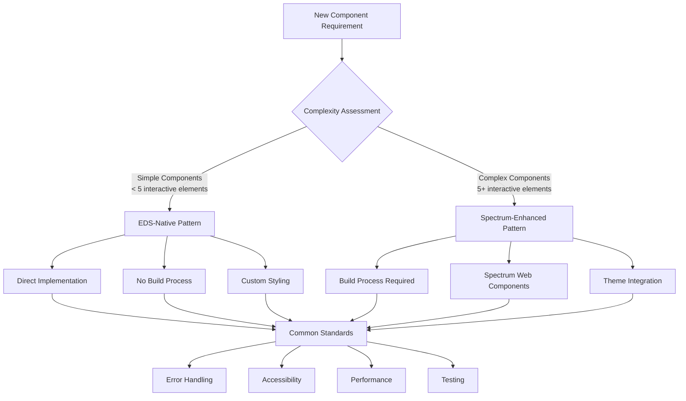

# Complete Guide: Building Professional EDS Components with Dual Architecture Patterns

A comprehensive tutorial for creating dynamic, accessible UI components using Adobe Edge Delivery Services with both EDS-Native and Spectrum-Enhanced patterns, featuring modern development workflows, comprehensive testing, and production deployment strategies.

## Table of Contents

1. [Prerequisites and Environment Setup](#prerequisites-and-environment-setup)
2. [Architecture Overview](#architecture-overview)
3. [Pattern Selection Guide](#pattern-selection-guide)
4. [Development Environment](#development-environment)
5. [EDS-Native Pattern Implementation](#eds-native-pattern-implementation)
6. [Spectrum-Enhanced Pattern Implementation](#spectrum-enhanced-pattern-implementation)
7. [Testing Standards](#testing-standards)
8. [Error Handling and Accessibility](#error-handling-and-accessibility)
9. [Performance Optimization](#performance-optimization)
10. [Production Deployment](#production-deployment)
11. [Troubleshooting](#troubleshooting)
12. [Advanced Patterns](#advanced-patterns)

## Prerequisites and Environment Setup

### System Requirements

Before starting, ensure you have:

- **Node.js 18+** for development tooling and build processes
- **Modern browser** with ES modules support (Chrome 91+, Firefox 89+, Safari 15+)
- **Git** for version control and project management
- **Code editor** with JavaScript and CSS support (VS Code recommended)

### Core Concepts

Understanding these concepts is essential:

- **Adobe Edge Delivery Services (EDS)** block architecture
- **ES Modules** and modern JavaScript patterns
- **Web Components** and Shadow DOM concepts
- **Progressive Enhancement** principles
- **Accessibility (WCAG 2.1)** standards

### Project Architecture Philosophy

This project follows key principles:

1. **Simplicity First**: No TypeScript, minimal build complexity
2. **Performance Focus**: Lazy loading, efficient DOM operations
3. **Accessibility**: WCAG compliance, keyboard navigation
4. **Maintainability**: Clear separation of concerns, comprehensive documentation
5. **Dual Pattern Support**: Choose the right tool for component complexity

## Architecture Overview

### Dual Pattern Framework

The project supports two complementary architectural patterns:



### Project Structure

```bash
spectrum-with-eds/
├── build/                          # 🔧 Development source files
│   └── {component-name}/           # Spectrum-Enhanced development
│       ├── {component-name}.js     # Source implementation
│       ├── {component-name}.css    # Source styles
│       ├── index.html              # Development test file
│       ├── package.json            # Dependencies and scripts
│       ├── vite.config.js          # Build configuration
│       └── README.md               # Development docs
├── blocks/                         # 📦 EDS deployment files
│   └── {component-name}/           # Both patterns deploy here
│       ├── {component-name}.js     # EDS-ready component
│       ├── {component-name}.css    # EDS-ready styles
│       ├── test.html               # EDS test file
│       ├── README.md               # Usage documentation
│       └── example.md              # Content author examples
├── styles/                         # 🎨 EDS native styles
│   ├── styles.css                  # Core design tokens
│   ├── fonts.css                   # Font definitions
│   └── lazy-styles.css             # Post-LCP styles
├── scripts/                        # 🛠️ Build automation
│   └── build-component.js          # Component build script
├── docs/                           # 📚 Documentation
│   ├── block-architecture-standards.md
│   ├── eds-native-testing-standards.md
│   ├── spectrum-enhanced-testing-standards.md
│   └── new-blog.md                 # This tutorial
├── server.js                       # 🚀 AEM emulation layer
├── server.html                     # Development homepage
├── package.json                    # Root project config
└── README.md                       # Project overview
```

## Pattern Selection Guide

### Decision Matrix

Use this matrix to choose the appropriate pattern:

| Criteria | EDS-Native | Spectrum-Enhanced |
|----------|------------|-------------------|
| **Interactive Elements** | < 5 elements | 5+ elements |
| **State Management** | Simple/None | Complex |
| **Design System** | Custom styling | Adobe Spectrum |
| **Build Process** | None required | Vite bundling |
| **Dependencies** | Minimal | External packages |
| **Performance** | Optimal | Good |
| **Development Speed** | Fast | Moderate |
| **Maintenance** | Simple | Structured |

### EDS-Native Pattern

**Best for:**

- Simple content blocks (alerts, banners, text components)
- Custom-styled components
- Performance-critical implementations
- Rapid prototyping
- Components with minimal interactivity

**Examples:**

- [`floating-alert`](../blocks/floating-alert/test.html)
- Content cards
- Navigation components
- Simple forms

### Spectrum-Enhanced Pattern

**Best for:**

- Complex interactive components
- Data-driven interfaces
- Rich UI components requiring consistent design
- Components with advanced state management
- Integration with Adobe ecosystem

**Examples:**

- [`spectrum-card`](../blocks/spectrum-card/test.html)
- Data tables
- Complex forms
- Dashboards
- Modal systems

## Development Environment

### AEM Emulation Layer

The project includes a sophisticated development server that simulates Adobe Edge Delivery Services locally:

#### Starting the Development Environment

```bash
# Start the AEM emulation server
node server.js

# Alternative with npm script
npm run serve
```

#### Server Features

```bash
🚀 Server running at http://localhost:3000
📁 Serving files from: /path/to/your/project
🔗 Proxying missing files to: https://allabout.network
📄 Main page: http://localhost:3000/server.html
```

The server provides:

1. **Local File Priority** - Serves project files directly for maximum development speed
2. **Intelligent Proxy** - Automatically fetches missing resources from production
3. **Real-time Logging** - Detailed request/response monitoring
4. **CORS Handling** - Automatic cross-origin request management
5. **MIME Type Support** - Comprehensive file type handling

#### Request Flow Example

```bash
Request: GET /server.html
Serving local file: /path/to/project/server.html

Request: GET /styles/styles.css
Serving local file: /path/to/project/styles/styles.css

Request: GET /slides/query-index.json
Local file not found, attempting proxy for: /slides/query-index.json
Proxying request to: https://allabout.network/slides/query-index.json
✅ Successfully proxied: /slides/query-index.json
```

### Essential Development Tools

```bash
# Install project dependencies
npm install

# Start development server
npm run serve

# Build components (Spectrum-Enhanced only)
npm run build:component

# Run tests
npm test
```

## EDS-Native Pattern Implementation

### Component Structure

EDS-Native components follow the standard EDS block structure:

```javascript
// blocks/component-name/component-name.js
const COMPONENT_CONFIG = {
  // Performance settings
  ANIMATION_DURATION: 300,
  DEBOUNCE_DELAY: 250,
  
  // Error handling
  MAX_RETRY_ATTEMPTS: 3,
  TIMEOUT_DURATION: 5000,
  
  // Accessibility
  FOCUS_TRAP_ENABLED: true,
  ARIA_LIVE_REGION: 'polite',
  
  // User messages
  LOADING_MESSAGE: 'Loading content...',
  ERROR_MESSAGE: 'Unable to load content. Please try again.',
  SUCCESS_MESSAGE: 'Content loaded successfully'
};

export default async function decorate(block) {
  try {
    // 1. Early validation and setup
    if (!block || !block.children.length) {
      throw new Error('Invalid block structure');
    }
    
    // 2. Configuration and state initialization
    const config = { ...COMPONENT_CONFIG };
    
    // 3. Content extraction using EDS pattern
    const content = extractContent(block);
    
    // 4. DOM element creation
    const container = createComponentStructure(content, config);
    
    // 5. Event handlers setup
    setupEventHandlers(container, config);
    
    // 6. Accessibility implementation
    setupAccessibility(container);
    
    // 7. Replace block content
    block.innerHTML = '';
    block.appendChild(container);
    
    // 8. Return cleanup function (optional)
    return () => cleanup(container);
    
  } catch (error) {
    handleComponentError(error, block, config);
  }
}

// Content extraction for EDS nested structure
function extractContent(block) {
  let contentSource = block;
  
  const firstDiv = block.querySelector('div');
  if (firstDiv) {
    const secondDiv = firstDiv.querySelector('div');
    if (secondDiv && (secondDiv.children.length > 0 || secondDiv.textContent.trim())) {
      contentSource = secondDiv;
    } else if (firstDiv.children.length > 0 || firstDiv.textContent.trim()) {
      contentSource = firstDiv;
    }
  }
  
  return contentSource;
}

// Standard error handling
function handleComponentError(error, block, config = {}) {
  console.error(`Component Error [${block.className}]:`, error);
  
  const errorContainer = document.createElement('div');
  errorContainer.className = 'component-error';
  errorContainer.setAttribute('role', 'alert');
  errorContainer.innerHTML = `
    <div class="error-content">
      <p>${config.ERROR_MESSAGE || 'Unable to load content. Please try again.'}</p>
      <button class="retry-button" onclick="location.reload()">Retry</button>
    </div>
  `;
  
  block.innerHTML = '';
  block.appendChild(errorContainer);
}
```

### CSS Integration with EDS Design Tokens

```css
/* blocks/component-name/component-name.css */
.component-name {
  /* Use EDS design tokens */
  font-family: var(--body-font-family);
  color: var(--text-color);
  background: var(--background-color);
  
  /* Component-specific styles */
  padding: 1rem;
  border-radius: 8px;
  box-shadow: 0 2px 10px rgba(0,0,0,0.1);
}

.component-name h2 {
  font-family: var(--heading-font-family);
  font-size: var(--heading-font-size-m);
  color: var(--text-color);
  margin: 0 0 1rem 0;
}

.component-name .button {
  background: var(--link-color);
  color: var(--background-color);
  border: 2px solid transparent;
  border-radius: 2.4em;
  padding: 0.5em 1.2em;
  font-family: var(--body-font-family);
  font-weight: 500;
  cursor: pointer;
  text-decoration: none;
  display: inline-block;
  transition: background-color 0.2s ease;
}

.component-name .button:hover {
  background: var(--link-hover-color);
}

.component-name .button:focus {
  outline: 2px solid var(--link-color);
  outline-offset: 2px;
}

/* Error state styling */
.component-error {
  padding: 1rem;
  background: #fee;
  border: 1px solid #fcc;
  border-radius: 4px;
  color: #c33;
}

.component-error .retry-button {
  background: #c33;
  color: white;
  border: none;
  padding: 0.5rem 1rem;
  border-radius: 4px;
  cursor: pointer;
  margin-top: 0.5rem;
}
```

### Test File Template

```html
<!DOCTYPE html>
<html lang="en">
<head>
    <meta charset="UTF-8">
    <meta name="viewport" content="width=device-width, initial-scale=1.0">
    <title>Component Test - EDS Native Pattern</title>
    
    <!-- EDS Native Styles (root-based paths for server.js) -->
    <link rel="stylesheet" href="/styles/styles.css">
    <link rel="stylesheet" href="/styles/fonts.css">
    <link rel="stylesheet" href="/styles/lazy-styles.css">
    <!-- Component CSS is loaded dynamically by EDS -->
    
    <style>
        /* Test-specific styling for nice presentation */
        body {
            padding: 2rem;
            background: var(--light-color);
        }
        
        .test-content {
            max-width: 1200px;
            margin: 0 auto;
            background: var(--background-color);
            padding: 2rem;
            border-radius: 8px;
            box-shadow: 0 2px 10px rgba(0,0,0,0.1);
        }
        
        .test-section {
            margin: 2rem 0;
            padding: 1rem;
            border: 1px solid var(--dark-color, #505050);
            border-radius: 4px;
        }
        
        /* Ensure body appears (EDS pattern) */
        body.appear {
            display: block;
        }
    </style>
</head>
<body>
    <div class="test-content">
        <h1>Component Test Page - EDS Native Pattern</h1>
        <p>Testing EDS-Native component with direct implementation.</p>
        
        <!-- Standard EDS Block Structure -->
        <div class="test-section">
            <h2>Basic Component Test</h2>
            <div class="component-name block" data-block-name="component-name" data-block-status="initialized">
                <div>
                    <div>
                        <!-- Test content here -->
                        <p>Sample content for testing</p>
                    </div>
                </div>
            </div>
        </div>
    </div>

    <script type="module">
        import decorate from '/blocks/component-name/component-name.js';
        
        // EDS Native initialization pattern
        document.addEventListener('DOMContentLoaded', () => {
            // Make body appear (EDS pattern)
            document.body.classList.add('appear');
            
            // Initialize components
            const blocks = document.querySelectorAll('.component-name.block');
            blocks.forEach(decorate);
        });
    </script>
</body>
</html>
```

## Spectrum-Enhanced Pattern Implementation

### Development Structure

Spectrum-Enhanced components use a build process for dependency bundling:

```bash
# Development workflow
cd build/spectrum-card
npm install
npm run dev  # Development server with hot reload
npm run build  # Create production bundle
```

### Component Implementation

```javascript
// build/spectrum-card/spectrum-card.js
import '@spectrum-web-components/theme/sp-theme.js';
import '@spectrum-web-components/theme/theme-light.js';
import '@spectrum-web-components/theme/scale-medium.js';
import '@spectrum-web-components/card/sp-card.js';
import '@spectrum-web-components/button/sp-button.js';

const SPECTRUM_CARD_CONFIG = {
  CARD_VARIANT: '',
  BUTTON_TREATMENT: 'accent',
  BUTTON_SIZE: 'm',
  MAX_WIDTH: '400px',
  DEFAULT_TITLE: 'Card Title',
  DEFAULT_DESCRIPTION: 'Card description',
  DEFAULT_BUTTON_TEXT: 'Learn More',
  QUERY_INDEX_PATH: '/slides/query-index.json',
};

export default async function decorate(block) {
  try {
    // Ensure Spectrum components are ready
    await customElements.whenDefined('sp-theme');
    await customElements.whenDefined('sp-card');
    
    // Extract content from EDS structure
    const content = extractContent(block);
    
    // Create Spectrum theme wrapper
    const themeWrapper = document.createElement('sp-theme');
    themeWrapper.color = 'light';
    themeWrapper.scale = 'medium';
    themeWrapper.system = 'spectrum';
    
    // Create container for cards
    const container = document.createElement('div');
    container.className = 'spectrum-card-container';
    container.style.cssText = `
      display: grid;
      grid-template-columns: repeat(auto-fit, minmax(300px, 1fr));
      gap: 20px;
      padding: 20px 0;
    `;
    
    // Fetch data and create cards
    const cardData = await fetchCardData(SPECTRUM_CARD_CONFIG.QUERY_INDEX_PATH);
    
    if (cardData.length === 0) {
      container.innerHTML = '<p>No cards available</p>';
    } else {
      cardData.forEach((data, index) => {
        const cardWrapper = createCard(data, index);
        container.appendChild(cardWrapper);
      });
    }
    
    themeWrapper.appendChild(container);
    
    // Replace block content
    block.innerHTML = '';
    block.appendChild(themeWrapper);
    
  } catch (error) {
    handleComponentError(error, block, SPECTRUM_CARD_CONFIG);
  }
}

// Data fetching with error handling
async function fetchCardData(queryPath) {
  try {
    const url = queryPath;
    console.debug('[spectrum-card] fetching data from:', url);
    
    const response = await fetch(url, {
      mode: 'cors',
      headers: { 'Accept': 'application/json' }
    });
    
    if (!response.ok) {
      throw new Error(`Failed to fetch card data: ${response.status}`);
    }
    
    const json = await response.json();
    console.debug('[spectrum-card] fetched data:', json);
    
    return json.data || [];
  } catch (error) {
    console.error('[spectrum-card] fetch error:', error);
    return [];
  }
}

// Card creation with Spectrum components
function createCard(cardData, index) {
  // Create wrapper for positioning context
  const cardWrapper = document.createElement('div');
  cardWrapper.style.position = 'relative';
  cardWrapper.style.maxWidth = SPECTRUM_CARD_CONFIG.MAX_WIDTH;
  cardWrapper.style.margin = '0 auto 20px auto';

  // Create Spectrum card
  const card = document.createElement('sp-card');
  card.setAttribute('heading', cardData.title || SPECTRUM_CARD_CONFIG.DEFAULT_TITLE);
  card.style.width = '100%';

  // Add image using preview slot
  if (cardData.image) {
    const img = document.createElement('img');
    img.setAttribute('slot', 'preview');
    img.src = cardData.image;
    img.alt = cardData.title || '';
    img.style.cssText = `
      width: 100%;
      height: 200px;
      object-fit: cover;
    `;
    img.loading = 'lazy';
    card.appendChild(img);
  }

  // Add description using description slot
  const descriptionDiv = document.createElement('div');
  descriptionDiv.setAttribute('slot', 'description');
  const mainDesc = document.createElement('p');
  mainDesc.style.fontWeight = 'bold';
  mainDesc.textContent = cardData.description || SPECTRUM_CARD_CONFIG.DEFAULT_DESCRIPTION;
  descriptionDiv.appendChild(mainDesc);
  card.appendChild(descriptionDiv);

  // Add action button
  const button = document.createElement('sp-button');
  button.treatment = SPECTRUM_CARD_CONFIG.BUTTON_TREATMENT;
  button.size = SPECTRUM_CARD_CONFIG.BUTTON_SIZE;
  button.textContent = cardData.buttonText || SPECTRUM_CARD_CONFIG.DEFAULT_BUTTON_TEXT;
  
  // Add click handler for modal
  button.addEventListener('click', () => {
    showContentModal(cardData, index);
  });
  
  card.appendChild(button);

  // Create numbered badge
  const slideNumber = document.createElement('div');
  slideNumber.className = 'slide-number';
  slideNumber.textContent = (index + 1).toString();
  slideNumber.style.cssText = `
    position: absolute;
    top: 10px;
    left: 10px;
    background-color: #0265DC;
    color: white;
    border-radius: 50%;
    width: 32px;
    height: 32px;
    display: flex;
    align-items: center;
    justify-content: center;
    font-size: 14px;
    font-weight: bold;
    z-index: 10;
    box-shadow: 0 2px 4px rgba(0,0,0,0.2);
  `;
  
  cardWrapper.appendChild(slideNumber);
  cardWrapper.appendChild(card);
  
  return cardWrapper;
}

// Modal implementation
async function showContentModal(cardData, index) {
  // Create modal overlay
  const overlay = document.createElement('div');
  overlay.className = 'spectrum-card-modal-overlay';
  overlay.style.cssText = `
    position: fixed;
    top: 0;
    left: 0;
    width: 100%;
    height: 100%;
    background-color: rgba(0, 0, 0, 0.8);
    z-index: 1000;
    display: flex;
    align-items: center;
    justify-content: center;
    padding: 20px;
    backdrop-filter: blur(4px);
  `;

  // Create modal content
  const modal = document.createElement('div');
  modal.className = 'spectrum-card-modal';
  modal.setAttribute('role', 'dialog');
  modal.setAttribute('aria-modal', 'true');
  modal.setAttribute('aria-labelledby', `modal-title-${index}`);
  
  const backgroundImage = cardData.image || 'https://images.unsplash.com/photo-1513635269975-59663e0ac1ad?ixlib=rb-4.0.3&auto=format&fit=crop&w=2340&q=80';
  modal.style.cssText = `
    background-image: url(${backgroundImage});
    background-size: cover;
    background-position: center;
    border-radius: 12px;
    max-width: 1000px;
    max-height: 80vh;
    width: 100%;
    height: 600px;
    position: relative;
    box-shadow: 0 8px 32px rgba(0, 0, 0, 0.5);
    overflow: hidden;
  `;

  // Create content overlay
  const contentOverlay = document.createElement('div');
  contentOverlay.style.cssText = `
    position: absolute;
    top: 0;
    left: 0;
    width: 100%;
    height: 100%;
    background: linear-gradient(135deg, rgba(30, 58, 138, 0.85) 0%, rgba(15, 23, 42, 0.75) 100%);
    display: flex;
    flex-direction: column;
    justify-content: center;
    align-items: flex-start;
    padding: 60px;
    color: white;
  `;

  // Create close button
  const closeButton = document.createElement('button');
  closeButton.innerHTML = '×';
  closeButton.setAttribute('aria-label', 'Close modal');
  closeButton.style.cssText = `
    position: absolute;
    top: 20px;
    right: 20px;
    background: rgba(255, 255, 255, 0.2);
    backdrop-filter: blur(10px);
    border: 2px solid rgba(255, 255, 255, 0.3);
    border-radius: 50%;
    width: 40px;
    height: 40px;
    color: white;
    font-size: 24px;
    cursor: pointer;
    display: flex;
    align-items: center;
    justify-content: center;
    transition: all 0.3s ease;
  `;

  // Create title
  const title = document.createElement('h1');
  title.id = `modal-title-${index}`;
  title.textContent = cardData.title || 'Untitled';
  title.style.cssText = `
    margin: 0 0 20px 0;
    font-size: 3.5rem;
    font-weight: 700;
    color: white;
    text-shadow: 2px 2px 4px rgba(0, 0, 0, 0.5);
    line-height: 1.1;
  `;

  // Create subtitle
  const subtitle = document.createElement('p');
  subtitle.textContent = cardData.description || 'No description available';
  subtitle.style.cssText = `
    margin: 0 0 30px 0;
    font-size: 1.25rem;
    font-weight: 500;
    color: rgba(255, 255, 255, 0.95);
    text-shadow: 1px 1px 2px rgba(0, 0, 0, 0.5);
    line-height: 1.4;
    max-width: 600px;
  `;

  // Assemble modal
  contentOverlay.appendChild(title);
  contentOverlay.appendChild(subtitle);
  modal.appendChild(contentOverlay);
  modal.appendChild(closeButton);
  overlay.appendChild(modal);
  document.body.appendChild(overlay);
  document.body.style.overflow = 'hidden';

  // Close modal function
  const closeModal = () => {
    document.body.removeChild(overlay);
    document.body.style.overflow = '';
  };

  // Event handlers
  closeButton.addEventListener('click', closeModal);
  overlay.addEventListener('click', (e) => {
    if (e.target === overlay) closeModal();
  });

  // ESC key support
  const handleEscape = (e) => {
    if (e.key === 'Escape') {
      closeModal();
      document.removeEventListener('keydown', handleEscape);
    }
  };
  document.addEventListener('keydown', handleEscape);

  // Focus management
  closeButton.focus();
}
```

### Build Configuration

```javascript
// build/spectrum-card/vite.config.js
import { defineConfig } from 'vite';

export default defineConfig({
  root: '.',
  server: {
    port: 5173,
    strictPort: true,
    open: true,
    host: true,
    proxy: {
      '/slides': {
        target: 'https://allabout.network',
        changeOrigin: true,
        secure: true
      }
    }
  },
  build: {
    lib: {
      entry: 'spectrum-card.js',
      name: 'SpectrumCard',
      fileName: () => 'spectrum-card.js',
      formats: ['es']
    },
    outDir: 'dist',
    rollupOptions: {
      external: [],
      output: {
        globals: {}
      }
    },
    emptyOutDir: true
  }
});
```

### Package Configuration

```json
{
  "name": "spectrum-card",
  "version": "1.0.0",
  "type": "module",
  "scripts": {
    "dev": "vite",
    "build": "vite build",
    "preview": "vite preview"
  },
  "dependencies": {
    "@spectrum-web-components/theme": "^0.42.4",
    "@spectrum-web-components/card": "^0.42.4",
    "@spectrum-web-components/button": "^0.42.4"
  },
  "devDependencies": {
    "vite": "^5.0.0"
  }
}
```

## Testing Standards

### EDS-Native Testing

EDS-Native components use direct testing without build processes:

```javascript
// Testing initialization
function testComponentInitialization() {
  const block = document.querySelector('.component-name.block');
  
  // Verify block exists
  assert(block !== null, 'Component block should exist');
  
  // Verify data attributes
  assert(block.getAttribute('data-block-name') === 'component-name', 'Block name should be set');
  assert(block.getAttribute('data-block-status') === 'initialized', 'Block status should be initialized');
  
  // Verify component was decorated
  assert(block.children.length > 0, 'Component should have content after decoration');
}

// Testing error handling
function testErrorHandling() {
  const invalidBlock = document.createElement('div');
  invalidBlock.className = 'component-name block';
  
  try {
    decorate(invalidBlock);
    assert(invalidBlock.querySelector('.component-error') !== null, 'Error state should be displayed');
  } catch (error) {
    assert(false, 'Component should handle errors gracefully');
  }
}

// Testing accessibility
function testAccessibility() {
  const component = document.querySelector('.component-name');
  
  // Check ARIA attributes
  assert(component.getAttribute('role') !== null, 'Component should have role attribute');
  assert(component.getAttribute('aria-label') !== null || 
         component.getAttribute('aria-labelledby') !== null, 
         'Component should have accessible name');
  
  // Test keyboard navigation
  const focusableElements = component.querySelectorAll(
    'button, [href], input, select, textarea, [tabindex]:not([tabindex="-1"])'
  );
  assert(focusableElements.length > 0, 'Component should have focusable elements');
}
```

### Spectrum-Enhanced Testing

Spectrum-Enhanced components require additional testing for build process and Spectrum integration:

```javascript
// Test Spectrum integration
async function testSpectrumIntegration() {
  // Wait for Spectrum components
  await customElements.whenDefined('sp-theme');
  await customElements.whenDefined('sp-card');
  
  const theme = document.querySelector('sp-theme');
  assert(theme !== null, 'sp-theme should be present');
  assert(theme.color === 'light', 'Theme should be set to light');
  
  // Test Spectrum component functionality
  const cards = document.querySelectorAll('sp-card');
  cards.forEach(card => {
    assert(card.shadowRoot !== null, 'Spectrum cards should have shadow DOM');
  });
}

// Test build process
function testBuildProcess() {
  // Verify bundled files exist
  const jsFile = '/blocks/spectrum-card/spectrum-card.js';
  const cssFile = '/blocks/spectrum-card/spectrum-card.css';
  
  fetch(jsFile).then(response => {
    assert(response.ok, 'Bundled JS file should be accessible');
    return response.text();
  }).then(content => {
    assert(!content.includes('import '), 'Bundle should not contain import statements');
  });
}

// Test modal accessibility
function testModalAccessibility() {
  const button = document.querySelector('sp-button');
  
  // Open modal
  button.click();
  
  const modal = document.querySelector('.spectrum-card-modal');
  assert(modal !== null, 'Modal should be created');
  assert(modal.getAttribute('role') === 'dialog', 'Modal should have dialog role');
  assert(modal.getAttribute('aria-modal') === 'true', 'Modal should have aria-modal');
  
  // Test focus management
  const closeButton = modal.querySelector('button');
  assert(document.activeElement === closeButton, 'Close button should be focused');
  
  // Test escape key
  const escapeEvent = new KeyboardEvent('keydown', { key: 'Escape' });
  modal.dispatchEvent(escapeEvent);
  
  setTimeout(() => {
    assert(document.querySelector('.spectrum-card-modal') === null, 
           'Modal should close on escape key');
  }, 100);
}
```

### Testing Checklist

#### EDS-Native Components

- [ ] Component initializes without errors
- [ ] EDS block structure is properly recognized
- [ ] Error handling displays user-friendly messages
- [ ] Keyboard navigation works correctly
- [ ] ARIA attributes are properly set
- [ ] Performance meets standards (< 200ms load time)

#### Spectrum-Enhanced Components

- [ ] Build process completes without errors
- [ ] Spectrum components render correctly
- [ ] Theme integration works properly
- [ ] Modal accessibility is implemented
- [ ] Bundle size is reasonable (< 500KB)
- [ ] Memory usage is optimized

## Error Handling and Accessibility

### Standardized Error Handling

```javascript
// Network request with retry mechanism
async function fetchWithRetry(url, options = {}, maxRetries = 3) {
  for (let attempt = 1; attempt <= maxRetries; attempt++) {
    try {
      const response = await fetch(url, {
        ...options,
        signal: AbortSignal.timeout(5000) // 5 second timeout
      });
      
      if (!response.ok) {
        throw new Error(`HTTP ${response.status}: ${response.statusText}`);
      }
      
      return response;
    } catch (error) {
      if (attempt === maxRetries) throw error;
      await new Promise(resolve => setTimeout(resolve, 1000 * attempt));
    }
  }
}

// User-friendly error display
function showErrorState(container, message, retryCallback) {
  const errorElement = document.createElement('div');
  errorElement.className = 'component-error';
  errorElement.setAttribute('role', 'alert');
  errorElement.innerHTML = `
    <div class="error-content">
      <h3>Something went wrong</h3>
      <p>${message}</p>
      <button class="retry-button" type="button">Try Again</button>
    </div>
  `;
  
  const retryButton = errorElement.querySelector('.retry-button');
  retryButton.addEventListener('click', retryCallback);
  
  container.innerHTML = '';
  container.appendChild(errorElement);
}
```

### Accessibility Implementation

```javascript
// Comprehensive accessibility setup
function setupAccessibility(container) {
  // 1. Semantic structure
  ensureSemanticStructure(container);
  
  // 2. ARIA attributes
  setupAriaAttributes(container);
  
  // 3. Keyboard navigation
  setupKeyboardNavigation(container);
  
  // 4. Focus management
  setupFocusManagement(container);
  
  // 5. Screen reader support
  setupScreenReaderSupport(container);
}

function setupKeyboardNavigation(container) {
  const focusableElements = container.querySelectorAll(
    'button, [href], input, select, textarea, [tabindex]:not([tabindex="-1"])'
  );
  
  container.addEventListener('keydown', (event) => {
    switch (event.key) {
      case 'Escape':
        handleEscapeKey(event, container);
        break;
      case 'Tab':
        handleTabNavigation(event, focusableElements);
        break;
      case 'Enter':
      case ' ':
        handleActivation(event);
        break;
      case 'ArrowRight':
      case 'ArrowDown':
        handleArrowNavigation(event, focusableElements, 1);
        break;
      case 'ArrowLeft':
      case 'ArrowUp':
        handleArrowNavigation(event, focusableElements, -1);
        break;
    }
  });
}

function setupAriaAttributes(container) {
  // Set appropriate ARIA roles
  if (!container.getAttribute('role')) {
    container.setAttribute('role', 'region');
  }
  
  // Add aria-label if needed
  if (!container.getAttribute('aria-label') && !container.getAttribute('aria-labelledby')) {
    const heading = container.querySelector('h1, h2, h3, h4, h5, h6');
    if (heading) {
      heading.id = heading.id || `heading-${Date.now()}`;
      container.setAttribute('aria-labelledby', heading.id);
    }
  }
  
  // Set up live regions for dynamic content
  const liveRegion = container.querySelector('[data-live-region]');
  if (liveRegion) {
    liveRegion.setAttribute('aria-live', 'polite');
    liveRegion.setAttribute('aria-atomic', 'true');
  }
}

// Screen reader announcements
function announceToScreenReader(message) {
  const announcement = document.createElement('div');
  announcement.setAttribute('aria-live', 'polite');
  announcement.setAttribute('aria-atomic', 'true');
  announcement.style.cssText = `
    position: absolute;
    left: -10000px;
    width: 1px;
    height: 1px;
    overflow: hidden;
  `;
  announcement.textContent = message;
  
  document.body.appendChild(announcement);
  setTimeout(() => document.body.removeChild(announcement), 1000);
}
```

## Performance Optimization

### Loading States and Optimization

```javascript
// Loading state management
function showLoadingState(container, message = 'Loading...') {
  const loader = document.createElement('div');
  loader.className = 'component-loader';
  loader.setAttribute('aria-live', 'polite');
  loader.innerHTML = `
    <div class="loader-content">
      <div class="spinner" aria-hidden="true"></div>
      <span class="loader-text">${message}</span>
    </div>
  `;
  
  container.appendChild(loader);
  return loader;
}

function hideLoadingState(loader) {
  if (loader && loader.parentNode) {
    loader.parentNode.removeChild(loader);
  }
}

// Debounced event handling
function debounce(func, wait) {
  let timeout;
  return function executedFunction(...args) {
    const later = () => {
      clearTimeout(timeout);
      func(...args);
    };
    clearTimeout(timeout);
    timeout = setTimeout(later, wait);
  };
}

// Intersection Observer for lazy loading
const lazyLoadObserver = new IntersectionObserver((entries) => {
  entries.forEach(entry => {
    if (entry.isIntersecting) {
      const element = entry.target;
      loadContent(element);
      lazyLoadObserver.unobserve(element);
    }
  });
}, {
  rootMargin: '50px'
});

// Memory management
function cleanup(container) {
  // Remove event listeners
  const elements = container.querySelectorAll('[data-cleanup]');
  elements.forEach(element => {
    const events = element.dataset.cleanup.split(',');
    events.forEach(event => {
      element.removeEventListener(event.trim(), element._handler);
    });
  });
  
  // Clear intervals and timeouts
  if (container._intervals) {
    container._intervals.forEach(clearInterval);
  }
  if (container._timeouts) {
    container._timeouts.forEach(clearTimeout);
  }
  
  // Remove from DOM
  if (container.parentNode) {
    container.parentNode.removeChild(container);
  }
}
```

### CSS Performance Patterns

```css
/* Efficient animations using transform and opacity */
.component-card {
  transform: translateZ(0); /* Force hardware acceleration */
  transition: transform 0.2s ease, opacity 0.2s ease;
}

.component-card:hover {
  transform: translateY(-2px) translateZ(0);
}

/* Efficient loading states */
.component-loader {
  display: flex;
  align-items: center;
  justify-content: center;
  padding: 2rem;
}

.spinner {
  width: 24px;
  height: 24px;
  border: 2px solid var(--light-color);
  border-top: 2px solid var(--link-color);
  border-radius: 50%;
  animation: spin 1s linear infinite;
}

@keyframes spin {
  0% { transform: rotate(0deg); }
  100% { transform: rotate(360deg); }
}

/* Responsive design with container queries */
.component-container {
  container-type: inline-size;
}

@container (min-width: 768px) {
  .component-grid {
    grid-template-columns: repeat(2, 1fr);
  }
}

@container (min-width: 1024px) {
  .component-grid {
    grid-template-columns: repeat(3, 1fr);
  }
}
```

## Production Deployment

### Environment Configuration

```javascript
// Environment-specific configurations
const ENV_CONFIG = {
  development: {
    baseUrl: '',
    debug: true,
    analytics: false,
    cacheTimeout: 0
  },
  staging: {
    baseUrl: 'https://staging.example.com',
    debug: true,
    analytics: true,
    cacheTimeout: 300000 // 5 minutes
  },
  production: {
    baseUrl: 'https://example.com',
    debug: false,
    analytics: true,
    cacheTimeout: 3600000 // 1 hour
  }
};

function getEnvironmentConfig() {
  const hostname = window.location.hostname;
  
  if (hostname === 'localhost' || hostname === '127.0.0.1') {
    return ENV_CONFIG.development;
  } else if (hostname.includes('staging')) {
    return ENV_CONFIG.staging;
  } else {
    return ENV_CONFIG.production;
  }
}
```

### Build Process for Production

```bash
# Spectrum-Enhanced components build process
cd build/spectrum-card
npm install
npm run build

# Copy built files to blocks directory
cd ../..
npm run build:component

# Verify build output
ls -la blocks/spectrum-card/
# Should contain:
# - spectrum-card.js (bundled)
# - spectrum-card.css (processed)
# - test.html (production test)
```

### Security Considerations

```javascript
// Content Security Policy helpers
function sanitizeHTML(html) {
  const div = document.createElement('div');
  div.textContent = html;
  return div.innerHTML;
}

// Safe URL validation
function isValidURL(url) {
  try {
    const urlObj = new URL(url);
    return ['http:', 'https:'].includes(urlObj.protocol);
  } catch {
    return false;
  }
}

// XSS prevention
function createSafeElement(tag, attributes = {}, textContent = '') {
  const element = document.createElement(tag);
  
  // Sanitize attributes
  Object.entries(attributes).forEach(([key, value]) => {
    if (typeof value === 'string') {
      element.setAttribute(key, value.replace(/[<>"']/g, ''));
    }
  });
  
  // Sanitize text content
  if (textContent) {
    element.textContent = textContent;
  }
  
  return element;
}
```

## Troubleshooting

### Common Issues and Solutions

#### Server.js Issues

**Problem**: `Error: listen EADDRINUSE :::3000`

**Solution**:

```bash
# Method 1: Use different port
PORT=3001 node server.js

# Method 2: Kill process using port 3000
lsof -ti:3000 | xargs kill -9

# Method 3: Find and kill specific process
ps aux | grep "node server.js"
kill -9 [PID]
```

**Problem**: Local files return 404 errors

**Solution**:

```bash
# Verify file structure
ls -la server.html
ls -la scripts/aem.js
ls -la styles/styles.css

# Check server logs for file path resolution
# Server should show: "Serving local file: /full/path/to/file"
```

#### Build Process Issues

**Problem**: Vite build fails with module resolution errors

**Solution**:

```bash
# Ensure proper package.json in build directory
cd build/spectrum-card
cat package.json  # Verify dependencies

# Clean install
rm -rf node_modules package-lock.json
npm install

# Check vite.config.js
cat vite.config.js  # Verify configuration
```

**Problem**: Spectrum components not rendering

**Solution**:

```javascript
// Ensure proper import order
import '@spectrum-web-components/theme/sp-theme.js';
import '@spectrum-web-components/theme/theme-light.js';
import '@spectrum-web-components/theme/scale-medium.js';
// Import specific components after theme

// Wait for components to be defined
await customElements.whenDefined('sp-theme');
await customElements.whenDefined('sp-card');
```

#### Component Issues

**Problem**: EDS block not initializing

**Solution**:

```html
<!-- Verify proper EDS block structure -->
<div class="component-name block" data-block-name="component-name" data-block-status="initialized">
  <div>
    <div>
      <!-- Content here -->
    </div>
  </div>
</div>
```

**Problem**: CSS not loading

**Solution**:

```javascript
// For EDS-Native: CSS is loaded automatically by EDS
// Verify file exists at: /blocks/component-name/component-name.css

// For Spectrum-Enhanced: CSS is bundled
// Verify build process completed successfully
```

### Debugging Tools

```javascript
// Component debugging utility
const ComponentDebugger = {
  logComponentState(component, label = 'Component State') {
    console.group(label);
    console.log('Element:', component);
    console.log('Classes:', component.className);
    console.log('Attributes:', Array.from(component.attributes).map(attr => `${attr.name}="${attr.value}"`));
    console.log('Children:', component.children.length);
    console.log('Text Content:', component.textContent.trim());
    console.groupEnd();
  },
  
  validateAccessibility(component) {
    const issues = [];
    
    // Check for required ARIA attributes
    if (!component.getAttribute('role') && !component.getAttribute('aria-label') && !component.getAttribute('aria-labelledby')) {
      issues.push('Missing accessible name (aria-label or aria-labelledby)');
    }
    
    // Check for focusable elements
    const focusable = component.querySelectorAll('button, [href], input, select, textarea, [tabindex]:not([tabindex="-1"])');
    if (focusable.length === 0) {
      issues.push('No focusable elements found');
    }
    
    // Check for proper heading structure
    const headings = component.querySelectorAll('h1, h2, h3, h4, h5, h6');
    if (headings.length > 0) {
      const levels = Array.from(headings).map(h => parseInt(h.tagName.charAt(1)));
      for (let i = 1; i < levels.length; i++) {
        if (levels[i] > levels[i-1] + 1) {
          issues.push('Heading levels skip (e.g., h2 to h4)');
          break;
        }
      }
    }
    
    if (issues.length > 0) {
      console.warn('Accessibility issues found:', issues);
    } else {
      console.log('✅ No accessibility issues detected');
    }
    
    return issues;
  },
  
  measurePerformance(label, fn) {
    const start = performance.now();
    const result = fn();
    const end = performance.now();
    console.log(`${label}: ${end - start}ms`);
    return result;
  }
};

// Usage
ComponentDebugger.logComponentState(document.querySelector('.spectrum-card'));
ComponentDebugger.validateAccessibility(document.querySelector('.component-name'));
```

## Advanced Patterns

### Plugin Architecture

```javascript
// Extensible plugin system
class ComponentPlugin {
  constructor(name, version) {
    this.name = name;
    this.version = version;
    this.hooks = new Map();
  }
  
  addHook(hookName, callback) {
    if (!this.hooks.has(hookName)) {
      this.hooks.set(hookName, []);
    }
    this.hooks.get(hookName).push(callback);
  }
  
  executeHook(hookName, data) {
    const callbacks = this.hooks.get(hookName) || [];
    return callbacks.reduce((result, callback) => {
      return callback(result) || result;
    }, data);
  }
}

// Example analytics plugin
class AnalyticsPlugin extends ComponentPlugin {
  constructor() {
    super('analytics', '1.0.0');
    
    this.addHook('component:initialized', (data) => {
      this.trackComponentLoad(data);
      return data;
    });
    
    this.addHook('component:interacted', (data) => {
      this.trackInteraction(data);
      return data;
    });
  }
  
  trackComponentLoad(data) {
    if (window.gtag) {
      window.gtag('event', 'component_load', {
        component_name: data.name,
        component_type: data.type
      });
    }
  }
  
  trackInteraction(data) {
    if (window.gtag) {
      window.gtag('event', 'component_interaction', {
        component_name: data.name,
        interaction_type: data.interaction
      });
    }
  }
}
```

### Multi-language Support

```javascript
// Internationalization system
class I18nManager {
  constructor(defaultLocale = 'en') {
    this.currentLocale = defaultLocale;
    this.translations = new Map();
    this.fallbackLocale = 'en';
  }
  
  addTranslations(locale, translations) {
    this.translations.set(locale, translations);
  }
  
  setLocale(locale) {
    this.currentLocale = locale;
    document.documentElement.lang = locale;
  }
  
  t(key, params = {}) {
    const translations = this.translations.get(this.currentLocale) || {};
    const fallbackTranslations = this.translations.get(this.fallbackLocale) || {};
    
    let translation = translations[key] || fallbackTranslations[key] || key;
    
    // Replace parameters
    Object.keys(params).forEach(param => {
      translation = translation.replace(`{{${param}}}`, params[param]);
    });
    
    return translation;
  }
  
  formatNumber(number, options = {}) {
    return new Intl.NumberFormat(this.currentLocale, options).format(number);
  }
  
  formatDate(date, options = {}) {
    return new Intl.DateTimeFormat(this.currentLocale, options).format(date);
  }
}

// Usage
const i18n = new I18nManager();

i18n.addTranslations('en', {
  'component.loading': 'Loading...',
  'component.error': 'Error loading content',
  'component.retry': 'Try Again',
  'component.close': 'Close'
});

i18n.addTranslations('es', {
  'component.loading': 'Cargando...',
  'component.error': 'Error al cargar contenido',
  'component.retry': 'Intentar de Nuevo',
  'component.close': 'Cerrar'
});
```

### Component Library Pattern

```javascript
// Reusable component library
class ComponentLibrary {
  constructor() {
    this.components = new Map();
    this.plugins = [];
    this.themes = new Map();
  }
  
  registerComponent(name, config) {
    this.components.set(name, config);
  }
  
  addPlugin(plugin) {
    this.plugins.push(plugin);
  }
  
  addTheme(name, theme) {
    this.themes.set(name, theme);
  }
  
  createComponent(name, data, options = {}) {
    const config = this.components.get(name);
    if (!config) {
      throw new Error(`Unknown component: ${name}`);
    }
    
    let component = config.create(data, options);
    
    // Apply plugins
    this.plugins.forEach(plugin => {
      component = plugin.executeHook('component:created', component);
    });
    
    // Apply theme
    if (options.theme && this.themes.has(options.theme)) {
      const theme = this.themes.get(options.theme);
      this.applyTheme(component, theme);
    }
    
    return component;
  }
  
  applyTheme(component, theme) {
    Object.entries(theme).forEach(([property, value]) => {
      component.style.setProperty(`--${property}`, value);
    });
  }
}
```

## Conclusion

This comprehensive guide provides a complete foundation for building professional EDS components using the dual-pattern architecture. The patterns and techniques demonstrated here can be adapted for various content types and use cases, from simple content blocks to complex interactive applications.

### Key Takeaways

1. **Architecture Flexibility**: The dual-pattern approach allows choosing the right tool for component complexity
2. **Development Efficiency**: Server.js emulation layer provides production-accurate testing environment
3. **Quality Standards**: Comprehensive testing, accessibility, and performance requirements ensure professional results
4. **Maintainability**: Clear documentation, error handling, and code organization enable long-term success
5. **Scalability**: Plugin architecture and component library patterns support growth and customization

### Next Steps

- **Experiment** with both patterns to understand their strengths
- **Implement** comprehensive testing for all components
- **Create** reusable component libraries for your organization
- **Contribute** improvements back to the community
- **Stay Updated** with EDS and Spectrum Web Components evolution

The combination of Adobe Edge Delivery Services and modern web development practices provides a powerful foundation for building fast, accessible, and maintainable web applications that scale with your needs.

---

| Metadata | Value |
| :---- | :---- |
| **Title** | Complete Guide: Building Professional EDS Components with Dual Architecture Patterns |
| **Description** | A comprehensive tutorial for creating dynamic, accessible UI components using Adobe Edge Delivery Services with both EDS-Native and Spectrum-Enhanced patterns, featuring modern development workflows, comprehensive testing, and production deployment strategies. |
| **Author** | Tom Cranstoun |
| **Version** | 2.0.0 |
| **Last Updated** | 2025-06-18 |
| **Tags** | EDS, Adobe, Spectrum, Web Components, JavaScript, Accessibility, Performance, Testing |
