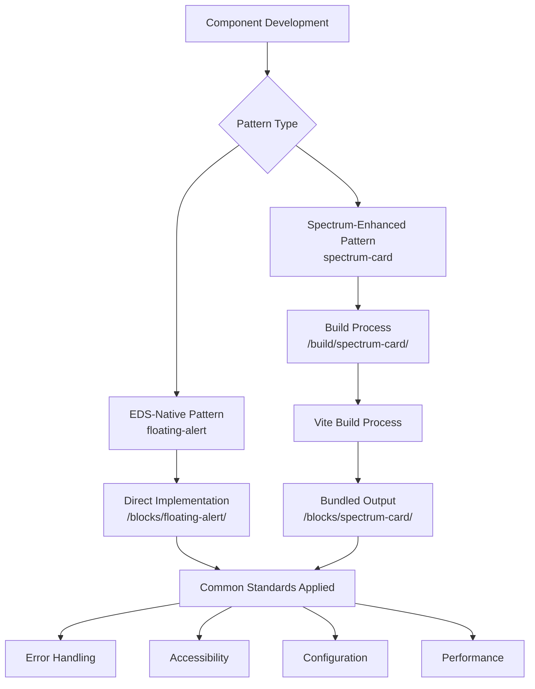

# Updated Component Refactoring Plan: Build Process Architecture

## Overview

This updated refactoring plan reflects the actual architecture where spectrum-card uses a build process (`/build/spectrum-card/` → `/blocks/spectrum-card/`) while floating-alert uses direct EDS-Native implementation. Both components will be standardized with common error handling, accessibility, and configuration patterns.

## Architecture Understanding



## Phase 1: floating-alert Refactoring (EDS-Native Pattern)

### Current State Assessment

- ✅ Good EDS-Native pattern implementation
- ✅ Basic error handling present
- ✅ Some accessibility features
- 🔄 Needs standardized configuration
- 🔄 Needs enhanced error handling with retry mechanisms
- 🔄 Needs improved accessibility patterns

### Refactoring Tasks

#### 1. Enhanced Configuration Standardization

**Update `blocks/floating-alert/floating-alert.js`:**

```javascript
// Enhanced standardized configuration
const FLOATING_ALERT_CONFIG = {
  // Performance settings
  ANIMATION_DURATION: 300,
  SPARKLE_INTERVAL: 2000,
  SPARKLE_DURATION: 1000,
  DEBOUNCE_DELAY: 250,
  
  // Error handling
  MAX_RETRY_ATTEMPTS: 3,
  TIMEOUT_DURATION: 5000,
  
  // Accessibility
  FOCUS_TRAP_ENABLED: true,
  ARIA_LIVE_REGION: 'polite',
  
  // Storage and persistence
  STORAGE_KEY: 'floating-alert-dismissed',
  
  // User messages
  LOADING_MESSAGE: 'Loading alert...',
  ERROR_MESSAGE: 'Unable to display alert. Please refresh the page.',
  SUCCESS_MESSAGE: 'Alert loaded successfully',
  
  // Feature flags
  ENABLE_ANALYTICS: true,
  ENABLE_DEBUG_LOGGING: false
};
```

#### 2. Enhanced Error Handling

**Add comprehensive error handling:**

```javascript
function handleFloatingAlertError(error, originalBlock) {
  console.error('Floating Alert Error:', error);
  
  const errorContainer = document.createElement('div');
  errorContainer.className = 'floating-alert-error';
  errorContainer.setAttribute('role', 'alert');
  errorContainer.setAttribute('aria-live', 'assertive');
  errorContainer.innerHTML = `
    <div class="error-content">
      <h3>Alert Unavailable</h3>
      <p>${FLOATING_ALERT_CONFIG.ERROR_MESSAGE}</p>
      <button class="retry-button" onclick="location.reload()">
        Refresh Page
      </button>
    </div>
  `;
  
  originalBlock.innerHTML = '';
  originalBlock.appendChild(errorContainer);
}

// Update main decorate function with timeout and retry logic
export default async function decorate(block) {
  try {
    // Early validation
    if (!block || !block.children.length) {
      throw new Error('Invalid block structure provided');
    }
    
    // Check if already dismissed
    if (localStorage.getItem(FLOATING_ALERT_CONFIG.STORAGE_KEY) === 'true') {
      console.log('Floating Alert: Already dismissed, skipping');
      return;
    }
    
    // Add timeout for processing
    const timeoutPromise = new Promise((_, reject) => 
      setTimeout(() => reject(new Error('Operation timeout')), 
      FLOATING_ALERT_CONFIG.TIMEOUT_DURATION)
    );
    
    const processingPromise = processAlertContent(block);
    
    await Promise.race([processingPromise, timeoutPromise]);
    
    // Continue with existing implementation...
    
  } catch (error) {
    handleFloatingAlertError(error, block);
  }
}
```

#### 3. Enhanced Accessibility

**Add comprehensive accessibility features:**

```javascript
function setupFloatingAlertAccessibility(modal, overlay) {
  // Enhanced ARIA attributes
  modal.setAttribute('role', 'dialog');
  modal.setAttribute('aria-modal', 'true');
  modal.setAttribute('aria-live', FLOATING_ALERT_CONFIG.ARIA_LIVE_REGION);
  
  // Improved focus management
  const previouslyFocused = document.activeElement;
  modal.focus();
  
  // Enhanced keyboard navigation
  modal.addEventListener('keydown', (event) => {
    switch (event.key) {
      case 'Escape':
        dismissAlert(overlay, block);
        break;
      case 'Tab':
        handleTabNavigation(event, modal);
        break;
    }
  });
  
  // Return focus on close
  modal.addEventListener('modal-close', () => {
    if (previouslyFocused && previouslyFocused.focus) {
      previouslyFocused.focus();
    }
  });
}
```

## Phase 2: spectrum-card Refactoring (Spectrum-Enhanced Pattern)

### Current State Assessment 2

- ✅ Implementation exists in `build/spectrum-card/spectrum-card.js`
- ✅ Basic configuration constants present
- ✅ Good Spectrum component integration
- ✅ Basic error handling with try/catch
- 🔄 Needs enhanced error handling with retry mechanisms
- 🔄 Needs comprehensive accessibility implementation
- 🔄 Needs standardized configuration structure
- 🔄 Needs performance optimizations

### Refactoring Tasks 2

#### 1. Enhanced Configuration Standardization

**Update `build/spectrum-card/spectrum-card.js`:**

```javascript
// Enhanced standardized configuration
const SPECTRUM_CARD_CONFIG = {
  // Performance settings
  ANIMATION_DURATION: 300,
  DEBOUNCE_DELAY: 250,
  
  // Error handling
  MAX_RETRY_ATTEMPTS: 3,
  TIMEOUT_DURATION: 5000,
  
  // Accessibility
  FOCUS_TRAP_ENABLED: false, // Cards don't typically trap focus
  ARIA_LIVE_REGION: 'polite',
  
  // Spectrum component settings
  CARD_VARIANT: '',
  BUTTON_TREATMENT: 'accent',
  BUTTON_SIZE: 'm',
  MAX_WIDTH: '400px',
  
  // Data fetching
  DEFAULT_QUERY_PATH: '/slides/query-index.json',
  
  // User messages
  LOADING_MESSAGE: 'Loading cards...',
  ERROR_MESSAGE: 'Unable to load card content. Please try again.',
  SUCCESS_MESSAGE: 'Cards loaded successfully',
  
  // Default content
  DEFAULT_TITLE: 'Card Title',
  DEFAULT_DESCRIPTION: 'Card description',
  DEFAULT_BUTTON_TEXT: 'Learn More',
  
  // Feature flags
  ENABLE_ANALYTICS: true,
  ENABLE_DEBUG_LOGGING: false
};
```

#### 2. Enhanced Error Handling with Retry Logic

**Add comprehensive error handling:**

```javascript
function handleSpectrumCardError(error, block) {
  console.error('Spectrum Card Error:', error);
  
  const errorContainer = document.createElement('div');
  errorContainer.className = 'spectrum-card-error';
  errorContainer.setAttribute('role', 'alert');
  errorContainer.setAttribute('aria-live', 'assertive');
  
  errorContainer.innerHTML = `
    <div class="error-content">
      <h3>Cards Unavailable</h3>
      <p>${SPECTRUM_CARD_CONFIG.ERROR_MESSAGE}</p>
      <button class="retry-button" onclick="location.reload()">
        Try Again
      </button>
    </div>
  `;
  
  block.innerHTML = '';
  block.appendChild(errorContainer);
}

// Enhanced fetch with retry logic
async function fetchCardDataWithRetry(queryPath, maxRetries = SPECTRUM_CARD_CONFIG.MAX_RETRY_ATTEMPTS) {
  for (let attempt = 1; attempt <= maxRetries; attempt++) {
    try {
      const { baseUrl } = getConfig();
      const url = `${baseUrl}${queryPath}`;
      
      const response = await fetch(url, {
        mode: 'cors',
        headers: { 'Accept': 'application/json' },
        signal: AbortSignal.timeout(SPECTRUM_CARD_CONFIG.TIMEOUT_DURATION)
      });
      
      if (!response.ok) {
        throw new Error(`HTTP ${response.status}: ${response.statusText}`);
      }
      
      const json = await response.json();
      return json.data || [];
    } catch (error) {
      if (attempt === maxRetries) throw error;
      
      // Exponential backoff
      await new Promise(resolve => 
        setTimeout(resolve, 1000 * Math.pow(2, attempt - 1))
      );
    }
  }
}
```

#### 3. Enhanced Accessibility Implementation

**Add comprehensive accessibility features:**

```javascript
function setupSpectrumCardAccessibility(container) {
  // Container accessibility
  container.setAttribute('role', 'region');
  container.setAttribute('aria-label', 'Card collection');
  
  // Process individual cards
  const cards = container.querySelectorAll('sp-card');
  cards.forEach((card, index) => {
    // Enhanced card accessibility
    card.setAttribute('role', 'article');
    card.setAttribute('tabindex', '0');
    
    // Add comprehensive ARIA labels
    const title = card.querySelector('.card-title, [slot="heading"]');
    const description = card.querySelector('.card-description, [slot="subheading"]');
    
    if (title) {
      title.id = title.id || `card-title-${index}`;
      card.setAttribute('aria-labelledby', title.id);
    }
    
    if (description) {
      description.id = description.id || `card-desc-${index}`;
      card.setAttribute('aria-describedby', description.id);
    }
    
    // Enhanced keyboard navigation
    setupCardKeyboardNavigation(card, index);
  });
}

function setupCardKeyboardNavigation(card, index) {
  card.addEventListener('keydown', (event) => {
    switch (event.key) {
      case 'Enter':
      case ' ':
        event.preventDefault();
        const button = card.querySelector('sp-button, button');
        if (button) {
          button.click();
        }
        break;
      case 'ArrowRight':
        focusNextCard(card);
        break;
      case 'ArrowLeft':
        focusPreviousCard(card);
        break;
    }
  });
}
```

#### 4. Enhanced Modal Accessibility

**Update modal implementation with accessibility:**

```javascript
function showContentModal(cardData, index) {
  // ... existing modal creation code ...
  
  // Enhanced modal accessibility
  modal.setAttribute('role', 'dialog');
  modal.setAttribute('aria-modal', 'true');
  modal.setAttribute('aria-labelledby', 'modal-title');
  modal.setAttribute('aria-describedby', 'modal-content');
  
  // Focus management
  const previouslyFocused = document.activeElement;
  
  // Enhanced keyboard navigation
  modal.addEventListener('keydown', (event) => {
    switch (event.key) {
      case 'Escape':
        closeModal();
        break;
      case 'Tab':
        trapFocusInModal(event, modal);
        break;
    }
  });
  
  // Close modal function with focus return
  function closeModal() {
    overlay.remove();
    if (previouslyFocused && previouslyFocused.focus) {
      previouslyFocused.focus();
    }
  }
  
  // Focus the modal
  modal.focus();
}
```

## Phase 3: Build Process Integration

### Update Build Process for Standards

#### 1. Update Build Script

**Enhance `scripts/build-component.js`:**

```javascript
function validateStandardsCompliance(distDir) {
  const jsFile = join(distDir, 'spectrum-card.js');
  
  if (existsSync(jsFile)) {
    const content = readFileSync(jsFile, 'utf8');
    
    // Check for required standards
    const hasErrorHandling = content.includes('handleSpectrumCardError');
    const hasAccessibility = content.includes('setAttribute(\'role\'');
    const hasConfiguration = content.includes('SPECTRUM_CARD_CONFIG');
    
    if (!hasErrorHandling) {
      console.warn('⚠️  Warning: Error handling patterns not found');
    }
    if (!hasAccessibility) {
      console.warn('⚠️  Warning: Accessibility patterns not found');
    }
    if (!hasConfiguration) {
      console.warn('⚠️  Warning: Configuration constants not found');
    }
    
    console.log('✅ Standards compliance check completed');
  }
}
```

#### 2. Update Development Workflow

**Add to `build/spectrum-card/package.json`:**

```json
{
  "scripts": {
    "dev": "vite",
    "build": "vite build",
    "build:component": "npm run build && node ../../scripts/build-component.js",
    "test:accessibility": "axe-core build/",
    "validate:standards": "node ../../scripts/validate-standards.js"
  }
}
```

## Phase 4: Shared Utilities Implementation

### Create Shared Utilities

**Create `blocks/shared/utils.js`:**

```javascript
// Shared utility functions for both patterns

export function debounce(func, wait) {
  let timeout;
  return function executedFunction(...args) {
    const later = () => {
      clearTimeout(timeout);
      func(...args);
    };
    clearTimeout(timeout);
    timeout = setTimeout(later, wait);
  };
}

export function announceToScreenReader(message) {
  const announcement = document.createElement('div');
  announcement.setAttribute('aria-live', 'polite');
  announcement.setAttribute('aria-atomic', 'true');
  announcement.className = 'sr-only';
  announcement.textContent = message;
  
  document.body.appendChild(announcement);
  
  setTimeout(() => {
    document.body.removeChild(announcement);
  }, 1000);
}

export function createLoadingSpinner(message = 'Loading...') {
  const spinner = document.createElement('div');
  spinner.className = 'component-loader';
  spinner.setAttribute('aria-live', 'polite');
  spinner.innerHTML = `
    <div class="loader-content">
      <div class="spinner" aria-hidden="true"></div>
      <span class="loader-text">${message}</span>
    </div>
  `;
  return spinner;
}

export function handleGenericError(error, container, config) {
  console.error('Component Error:', error);
  
  const errorContainer = document.createElement('div');
  errorContainer.className = 'component-error';
  errorContainer.setAttribute('role', 'alert');
  errorContainer.innerHTML = `
    <div class="error-content">
      <p>${config.ERROR_MESSAGE}</p>
      <button class="retry-button" onclick="location.reload()">
        Retry
      </button>
    </div>
  `;
  
  container.innerHTML = '';
  container.appendChild(errorContainer);
}
```

## Implementation Checklist

### floating-alert Refactoring (EDS-Native)

- [ ] Update configuration constants in `blocks/floating-alert/floating-alert.js`
- [ ] Implement enhanced error handling with timeout and retry
- [ ] Add comprehensive accessibility features
- [ ] Add performance optimizations (debouncing, loading states)
- [ ] Update test file with new features
- [ ] Import and use shared utilities
- [ ] Update CSS with common error/loading styles

### spectrum-card Refactoring (Spectrum-Enhanced)

- [ ] Update configuration constants in `build/spectrum-card/spectrum-card.js`
- [ ] Implement enhanced error handling with retry mechanisms
- [ ] Add comprehensive accessibility features
- [ ] Enhance modal accessibility
- [ ] Add performance optimizations
- [ ] Import and use shared utilities
- [ ] Update CSS with common error/loading styles
- [ ] Run build process: `npm run build:component`
- [ ] Validate built output in `blocks/spectrum-card/`

### Build Process Updates

- [ ] Enhance `scripts/build-component.js` with standards validation
- [ ] Update `build/spectrum-card/package.json` with new scripts
- [ ] Create standards validation script
- [ ] Test build process with refactored code

### Shared Components

- [ ] Create `blocks/shared/utils.js`
- [ ] Create `blocks/shared/common.css`
- [ ] Update both components to use shared utilities
- [ ] Test shared functionality across both patterns

### Validation & Testing

- [ ] Run accessibility audit on both components
- [ ] Test error handling scenarios
- [ ] Verify keyboard navigation
- [ ] Test screen reader compatibility
- [ ] Validate performance improvements
- [ ] Cross-browser testing
- [ ] Mobile responsiveness testing
- [ ] Test build process end-to-end

## Success Criteria

1. **Pattern Consistency**: Both patterns follow standardized configuration, error handling, and accessibility patterns
2. **Build Process Integration**: Spectrum-Enhanced pattern maintains build process while meeting standards
3. **Error Handling**: Comprehensive error handling with retry mechanisms and user-friendly messages
4. **Accessibility**: Full keyboard navigation, screen reader support, and ARIA compliance
5. **Performance**: Loading states, debouncing, and optimized rendering
6. **Code Quality**: Shared utilities, consistent patterns, and maintainable code
7. **Build Validation**: Automated standards compliance checking in build process
8. **Documentation**: Updated documentation reflecting both patterns and build process

## Timeline

- **Week 1**: floating-alert refactoring and shared utilities creation
- **Week 2**: spectrum-card source refactoring in `/build/spectrum-card/`
- **Week 3**: Build process updates and standards validation
- **Week 4**: Testing, validation, and documentation updates

This updated plan respects the existing build process architecture while ensuring both components meet the established common standards.
