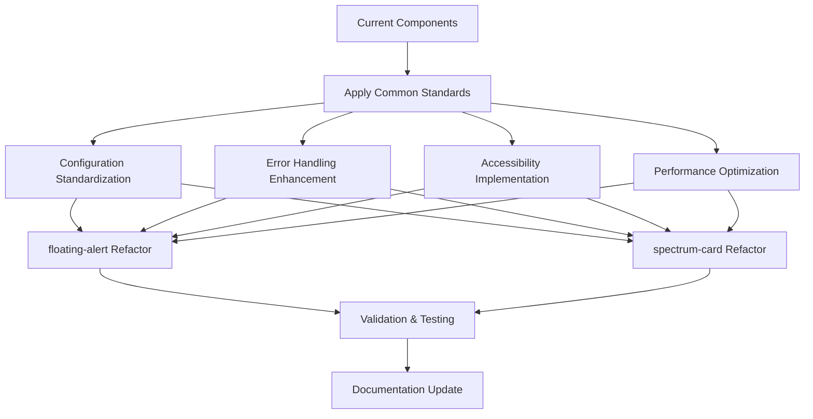

# Component Refactoring Plan: Standardization Implementation

## Overview

This document outlines the specific refactoring steps to bring both `floating-alert` and `spectrum-card` components up to the common standards defined in the [Block Architecture Standards](./block-architecture-standards.md). The refactoring focuses on three key areas: configuration standardization, error handling enhancement, and accessibility implementation.

## Refactoring Strategy



## Phase 1: floating-alert Component Refactoring

### Current State Assessment

- ✅ Good EDS-Native pattern implementation
- ✅ Basic error handling present
- ✅ Some accessibility features
- 🔄 Needs standardized configuration
- 🔄 Needs enhanced error handling
- 🔄 Needs improved accessibility patterns

### Refactoring Tasks

#### 1. Configuration Standardization

**Current Configuration:**

```javascript
const FLOATING_ALERT_CONFIG = {
  STORAGE_KEY: 'floating-alert-dismissed',
  ANIMATION_DURATION: 300,
  SPARKLE_INTERVAL: 2000,
  SPARKLE_DURATION: 1000,
};
```

**Refactored Configuration:**

```javascript
const FLOATING_ALERT_CONFIG = {
  // Performance settings
  ANIMATION_DURATION: 300,
  SPARKLE_INTERVAL: 2000,
  SPARKLE_DURATION: 1000,
  DEBOUNCE_DELAY: 250,
  
  // Error handling
  MAX_RETRY_ATTEMPTS: 3,
  TIMEOUT_DURATION: 5000,
  
  // Accessibility
  FOCUS_TRAP_ENABLED: true,
  ARIA_LIVE_REGION: 'polite',
  
  // Storage and persistence
  STORAGE_KEY: 'floating-alert-dismissed',
  
  // User messages
  LOADING_MESSAGE: 'Loading alert...',
  ERROR_MESSAGE: 'Unable to display alert. Please refresh the page.',
  SUCCESS_MESSAGE: 'Alert loaded successfully',
  
  // Feature flags
  ENABLE_ANALYTICS: true,
  ENABLE_DEBUG_LOGGING: false
};
```

#### 2. Enhanced Error Handling

**Add Standardized Error Handling Function:**

```javascript
function handleFloatingAlertError(error, originalBlock) {
  // Log error for debugging
  console.error('Floating Alert Error:', error);
  
  // Show user-friendly error state
  const errorContainer = document.createElement('div');
  errorContainer.className = 'floating-alert-error';
  errorContainer.setAttribute('role', 'alert');
  errorContainer.setAttribute('aria-live', 'assertive');
  errorContainer.innerHTML = `
    <div class="error-content">
      <h3>Alert Unavailable</h3>
      <p>${FLOATING_ALERT_CONFIG.ERROR_MESSAGE}</p>
      <button class="retry-button" onclick="location.reload()">
        Refresh Page
      </button>
    </div>
  `;
  
  // Replace original block content
  originalBlock.innerHTML = '';
  originalBlock.appendChild(errorContainer);
}
```

**Update Main Decorate Function:**

```javascript
export default async function decorate(block) {
  try {
    // Early validation
    if (!block || !block.children.length) {
      throw new Error('Invalid block structure provided');
    }
    
    // Check if already dismissed
    if (localStorage.getItem(FLOATING_ALERT_CONFIG.STORAGE_KEY) === 'true') {
      console.log('Floating Alert: Already dismissed, skipping');
      return;
    }
    
    // Show loading state for complex operations
    const loadingIndicator = showLoadingState(block);
    
    // Process content with timeout
    const timeoutPromise = new Promise((_, reject) => 
      setTimeout(() => reject(new Error('Operation timeout')), 
      FLOATING_ALERT_CONFIG.TIMEOUT_DURATION)
    );
    
    const processingPromise = processAlertContent(block);
    
    await Promise.race([processingPromise, timeoutPromise]);
    
    // Hide loading state
    hideLoadingState(loadingIndicator);
    
    // Continue with existing implementation...
    
  } catch (error) {
    handleFloatingAlertError(error, block);
  }
}
```

#### 3. Accessibility Enhancements

**Add Comprehensive Accessibility Setup:**

```javascript
function setupFloatingAlertAccessibility(modal, overlay) {
  // Set up ARIA attributes
  modal.setAttribute('role', 'dialog');
  modal.setAttribute('aria-modal', 'true');
  modal.setAttribute('aria-live', FLOATING_ALERT_CONFIG.ARIA_LIVE_REGION);
  
  // Add aria-label if no heading present
  const heading = modal.querySelector('h1, h2, h3, h4, h5, h6');
  if (heading) {
    heading.id = heading.id || `alert-heading-${Date.now()}`;
    modal.setAttribute('aria-labelledby', heading.id);
  } else {
    modal.setAttribute('aria-label', 'Important notification');
  }
  
  // Set up focus management
  setupFocusManagement(modal);
  
  // Enhanced keyboard navigation
  setupEnhancedKeyboardNavigation(modal, overlay);
  
  // Screen reader announcements
  announceToScreenReader('Alert dialog opened');
}

function setupFocusManagement(modal) {
  // Store previously focused element
  const previouslyFocused = document.activeElement;
  
  // Focus the modal
  modal.focus();
  
  // Return focus when modal closes
  modal.addEventListener('modal-close', () => {
    if (previouslyFocused && previouslyFocused.focus) {
      previouslyFocused.focus();
    }
  });
  
  // Trap focus within modal
  if (FLOATING_ALERT_CONFIG.FOCUS_TRAP_ENABLED) {
    trapFocusInModal(modal);
  }
}

function trapFocusInModal(modal) {
  const focusableElements = modal.querySelectorAll(
    'button, [href], input, select, textarea, [tabindex]:not([tabindex="-1"])'
  );
  
  const firstElement = focusableElements[0];
  const lastElement = focusableElements[focusableElements.length - 1];
  
  modal.addEventListener('keydown', (event) => {
    if (event.key === 'Tab') {
      if (event.shiftKey && document.activeElement === firstElement) {
        lastElement.focus();
        event.preventDefault();
      } else if (!event.shiftKey && document.activeElement === lastElement) {
        firstElement.focus();
        event.preventDefault();
      }
    }
  });
}
```

#### 4. Performance Optimizations

**Add Loading States and Debouncing:**

```javascript
function showLoadingState(container, message = FLOATING_ALERT_CONFIG.LOADING_MESSAGE) {
  const loader = document.createElement('div');
  loader.className = 'floating-alert-loader';
  loader.setAttribute('aria-live', 'polite');
  loader.innerHTML = `
    <div class="loader-content">
      <div class="spinner" aria-hidden="true"></div>
      <span class="loader-text">${message}</span>
    </div>
  `;
  
  container.appendChild(loader);
  return loader;
}

function hideLoadingState(loader) {
  if (loader && loader.parentNode) {
    loader.parentNode.removeChild(loader);
  }
}

// Debounced dismiss function
const debouncedDismiss = debounce((overlay, originalBlock) => {
  dismissAlert(overlay, originalBlock);
}, FLOATING_ALERT_CONFIG.DEBOUNCE_DELAY);
```

## Phase 2: spectrum-card Component Refactoring

### Current State Assessment

- ❌ Missing implementation file (`spectrum-card.js`)
- ❌ No error handling
- ❌ No accessibility implementation
- ❌ No configuration constants
- ✅ Good Spectrum component integration in test file

### Refactoring Tasks

#### 1. Create Missing Implementation File

**Create `blocks/spectrum-card/spectrum-card.js`:**

```javascript
// Import required Spectrum components
import '@spectrum-web-components/theme/theme-light.js';
import '@spectrum-web-components/theme/scale-medium.js';
import '@spectrum-web-components/theme/sp-theme.js';

// Standardized configuration
const SPECTRUM_CARD_CONFIG = {
  // Performance settings
  ANIMATION_DURATION: 300,
  DEBOUNCE_DELAY: 250,
  
  // Error handling
  MAX_RETRY_ATTEMPTS: 3,
  TIMEOUT_DURATION: 5000,
  
  // Accessibility
  FOCUS_TRAP_ENABLED: false, // Cards don't typically trap focus
  ARIA_LIVE_REGION: 'polite',
  
  // Data fetching
  DEFAULT_QUERY_PATH: '/slides/query-index.json',
  
  // User messages
  LOADING_MESSAGE: 'Loading cards...',
  ERROR_MESSAGE: 'Unable to load card content. Please try again.',
  SUCCESS_MESSAGE: 'Cards loaded successfully',
  
  // Feature flags
  ENABLE_ANALYTICS: true,
  ENABLE_DEBUG_LOGGING: false
};

export default async function decorate(block) {
  try {
    // Early validation
    if (!block) {
      throw new Error('Invalid block element provided');
    }
    
    // Show loading state
    const loadingIndicator = showLoadingState(block);
    
    // Ensure Spectrum components are loaded
    await ensureSpectrumComponents();
    
    // Extract content and configuration
    const content = extractCardContent(block);
    const queryPath = content.queryPath || SPECTRUM_CARD_CONFIG.DEFAULT_QUERY_PATH;
    
    // Fetch card data with error handling
    const cardData = await fetchCardDataWithRetry(queryPath);
    
    // Create card structure
    const cardContainer = createSpectrumCardStructure(cardData);
    
    // Set up accessibility
    setupSpectrumCardAccessibility(cardContainer);
    
    // Set up event handlers
    setupSpectrumCardEvents(cardContainer);
    
    // Hide loading state
    hideLoadingState(loadingIndicator);
    
    // Replace block content
    block.innerHTML = '';
    block.appendChild(cardContainer);
    
    // Return cleanup function
    return () => cleanupSpectrumCard(cardContainer);
    
  } catch (error) {
    handleSpectrumCardError(error, block);
  }
}
```

#### 2. Error Handling Implementation

**Add Comprehensive Error Handling:**

```javascript
function handleSpectrumCardError(error, block) {
  console.error('Spectrum Card Error:', error);
  
  const errorContainer = document.createElement('div');
  errorContainer.className = 'spectrum-card-error';
  errorContainer.setAttribute('role', 'alert');
  errorContainer.setAttribute('aria-live', 'assertive');
  
  errorContainer.innerHTML = `
    <div class="error-content">
      <h3>Cards Unavailable</h3>
      <p>${SPECTRUM_CARD_CONFIG.ERROR_MESSAGE}</p>
      <button class="retry-button" onclick="location.reload()">
        Try Again
      </button>
    </div>
  `;
  
  block.innerHTML = '';
  block.appendChild(errorContainer);
}

async function fetchCardDataWithRetry(url, maxRetries = SPECTRUM_CARD_CONFIG.MAX_RETRY_ATTEMPTS) {
  for (let attempt = 1; attempt <= maxRetries; attempt++) {
    try {
      const response = await fetch(url, {
        signal: AbortSignal.timeout(SPECTRUM_CARD_CONFIG.TIMEOUT_DURATION)
      });
      
      if (!response.ok) {
        throw new Error(`HTTP ${response.status}: ${response.statusText}`);
      }
      
      return await response.json();
    } catch (error) {
      if (attempt === maxRetries) throw error;
      
      // Exponential backoff
      await new Promise(resolve => 
        setTimeout(resolve, 1000 * Math.pow(2, attempt - 1))
      );
    }
  }
}
```

#### 3. Accessibility Implementation

**Add Spectrum Card Accessibility:**

```javascript
function setupSpectrumCardAccessibility(container) {
  // Set up container accessibility
  container.setAttribute('role', 'region');
  container.setAttribute('aria-label', 'Card collection');
  
  // Process individual cards
  const cards = container.querySelectorAll('.card-item');
  cards.forEach((card, index) => {
    // Set up card accessibility
    card.setAttribute('role', 'article');
    card.setAttribute('tabindex', '0');
    
    // Add aria-label for screen readers
    const title = card.querySelector('.card-title');
    const description = card.querySelector('.card-description');
    
    if (title) {
      title.id = title.id || `card-title-${index}`;
      card.setAttribute('aria-labelledby', title.id);
    }
    
    if (description) {
      description.id = description.id || `card-desc-${index}`;
      card.setAttribute('aria-describedby', description.id);
    }
    
    // Keyboard navigation
    setupCardKeyboardNavigation(card);
  });
  
  // Set up focus management
  setupCardFocusManagement(container);
}

function setupCardKeyboardNavigation(card) {
  card.addEventListener('keydown', (event) => {
    switch (event.key) {
      case 'Enter':
      case ' ':
        event.preventDefault();
        const button = card.querySelector('button, [role="button"]');
        if (button) {
          button.click();
        }
        break;
      case 'ArrowRight':
      case 'ArrowLeft':
        navigateBetweenCards(event, card);
        break;
    }
  });
}
```

## Phase 3: Common Utilities Implementation

### Shared Utility Functions

**Create `blocks/shared/utils.js`:**

```javascript
// Shared utility functions for both components

export function debounce(func, wait) {
  let timeout;
  return function executedFunction(...args) {
    const later = () => {
      clearTimeout(timeout);
      func(...args);
    };
    clearTimeout(timeout);
    timeout = setTimeout(later, wait);
  };
}

export function announceToScreenReader(message) {
  const announcement = document.createElement('div');
  announcement.setAttribute('aria-live', 'polite');
  announcement.setAttribute('aria-atomic', 'true');
  announcement.className = 'sr-only';
  announcement.textContent = message;
  
  document.body.appendChild(announcement);
  
  setTimeout(() => {
    document.body.removeChild(announcement);
  }, 1000);
}

export function createLoadingSpinner(message = 'Loading...') {
  const spinner = document.createElement('div');
  spinner.className = 'component-loader';
  spinner.setAttribute('aria-live', 'polite');
  spinner.innerHTML = `
    <div class="loader-content">
      <div class="spinner" aria-hidden="true"></div>
      <span class="loader-text">${message}</span>
    </div>
  `;
  return spinner;
}

export function handleGenericError(error, container, config) {
  console.error('Component Error:', error);
  
  const errorContainer = document.createElement('div');
  errorContainer.className = 'component-error';
  errorContainer.setAttribute('role', 'alert');
  errorContainer.innerHTML = `
    <div class="error-content">
      <p>${config.ERROR_MESSAGE}</p>
      <button class="retry-button" onclick="location.reload()">
        Retry
      </button>
    </div>
  `;
  
  container.innerHTML = '';
  container.appendChild(errorContainer);
}
```

## Phase 4: CSS Standardization

### Shared Error and Loading Styles

**Create `blocks/shared/common.css`:**

```css
/* Common styles for all components */
.component-loader {
  display: flex;
  align-items: center;
  justify-content: center;
  padding: var(--spacing-xl, 32px);
  background: var(--color-background, #ffffff);
  border-radius: var(--border-radius-medium, 8px);
}

.loader-content {
  display: flex;
  flex-direction: column;
  align-items: center;
  gap: var(--spacing-m, 16px);
}

.spinner {
  width: 32px;
  height: 32px;
  border: 3px solid var(--color-border, #e1e1e1);
  border-top: 3px solid var(--color-primary, #1473e6);
  border-radius: 50%;
  animation: spin 1s linear infinite;
}

@keyframes spin {
  0% { transform: rotate(0deg); }
  100% { transform: rotate(360deg); }
}

.component-error {
  padding: var(--spacing-l, 24px);
  background: var(--color-background, #ffffff);
  border: 1px solid var(--color-error, #d7373f);
  border-radius: var(--border-radius-medium, 8px);
  text-align: center;
}

.error-content h3 {
  color: var(--color-error, #d7373f);
  margin: 0 0 var(--spacing-m, 16px) 0;
}

.retry-button {
  background: var(--color-primary, #1473e6);
  color: white;
  border: none;
  padding: var(--spacing-s, 8px) var(--spacing-m, 16px);
  border-radius: var(--border-radius-small, 4px);
  cursor: pointer;
  font-weight: var(--font-weight-bold, 700);
  transition: background-color var(--transition-fast, 0.15s ease);
}

.retry-button:hover {
  background: var(--color-secondary, #2680eb);
}

.retry-button:focus {
  outline: 2px solid var(--color-primary, #1473e6);
  outline-offset: 2px;
}

/* Screen reader only content */
.sr-only {
  position: absolute;
  width: 1px;
  height: 1px;
  padding: 0;
  margin: -1px;
  overflow: hidden;
  clip: rect(0, 0, 0, 0);
  white-space: nowrap;
  border: 0;
}
```

## Phase 5: Test File Standardization

### Update Test Files

**Update `blocks/floating-alert/test.html`:**

- Add error handling test scenarios
- Include accessibility testing instructions
- Standardize styling and structure

**Update `blocks/spectrum-card/test.html`:**

- Fix import path to `./spectrum-card.js`
- Add error handling test scenarios
- Include accessibility testing instructions

## Implementation Checklist

### floating-alert Refactoring

- [ ] Update configuration constants
- [ ] Implement enhanced error handling
- [ ] Add comprehensive accessibility features
- [ ] Add performance optimizations
- [ ] Update test file with new features
- [ ] Add shared utility imports
- [ ] Update CSS with common styles

### spectrum-card Refactoring

- [ ] Create missing `spectrum-card.js` file
- [ ] Implement standardized configuration
- [ ] Add comprehensive error handling
- [ ] Implement accessibility features
- [ ] Add performance optimizations
- [ ] Fix test file import path
- [ ] Add shared utility imports
- [ ] Update CSS with common styles

### Shared Components

- [ ] Create `blocks/shared/utils.js`
- [ ] Create `blocks/shared/common.css`
- [ ] Update both components to use shared utilities
- [ ] Test shared functionality

### Validation

- [ ] Run accessibility audit on both components
- [ ] Test error handling scenarios
- [ ] Verify keyboard navigation
- [ ] Test screen reader compatibility
- [ ] Validate performance improvements
- [ ] Cross-browser testing
- [ ] Mobile responsiveness testing

## Success Criteria

1. **Configuration Consistency**: Both components use standardized configuration patterns
2. **Error Handling**: Comprehensive error handling with user-friendly messages and retry mechanisms
3. **Accessibility**: Full keyboard navigation, screen reader support, and ARIA compliance
4. **Performance**: Loading states, debouncing, and optimized rendering
5. **Code Quality**: Shared utilities, consistent patterns, and maintainable code
6. **Testing**: Updated test files with comprehensive scenarios
7. **Documentation**: Updated README files reflecting new features

## Timeline

- **Week 1**: floating-alert refactoring and shared utilities
- **Week 2**: spectrum-card implementation and refactoring
- **Week 3**: Testing, validation, and documentation updates
- **Week 4**: Final review and deployment

This refactoring plan ensures both components meet the established common standards while maintaining their unique functionality and design patterns.
